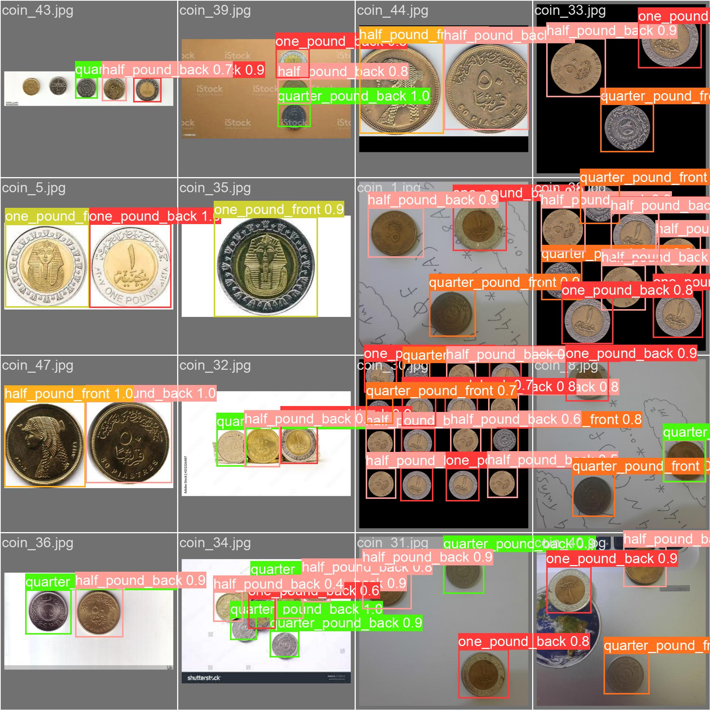
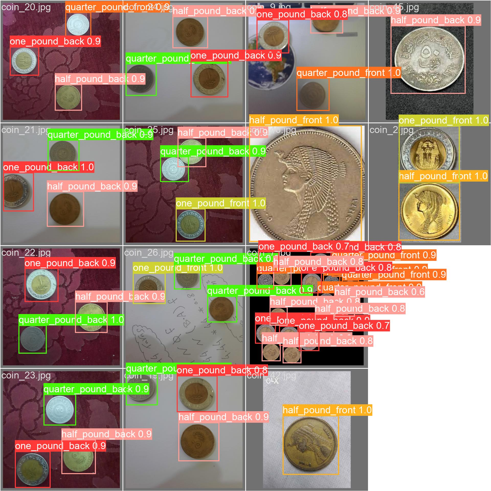

<h1 align="center">CoinDetector</h1>

<h3 align="center">YOLOv8-based model for Egyptian coin detection and classification. Dataset, model weights, and training details included for object detection and recognition tasks.</h3>

  <a href="#dataset">Dataset</a> •
  <a href="#model">Model</a> •
  <a href="#training">Training</a> •
  <a href="#results">Results</a> •

---

  Welcome to CoinDetector, a state-of-the-art computer vision model designed for detecting and classifying Egyptian coins. This repository contains everything you need to get started with object detection and recognition tasks using our YOLOv8-based model.

## Contents

- [Dataset](#dataset)
- [Model](#model)
- [Training](#training)
- [Results](#results)

## Dataset
- The dataset used for training and testing the model can be found in the [DataSetDrive_link.txt](DataSetDrive_link.txt) file.

## Model
- The YOLOv8 model and weights are available in the [Model](Model) directory.

## Training
- Details about the training process and configuration can be found in the [train2](train2) directory.

## Results
- Various results, including confusion matrices and images, are available in the [train2](train2) directory.

## Example Output

## License

This project is licensed under the [IMT] License

## Acknowledgments

- Mention any credits or acknowledgments here.
